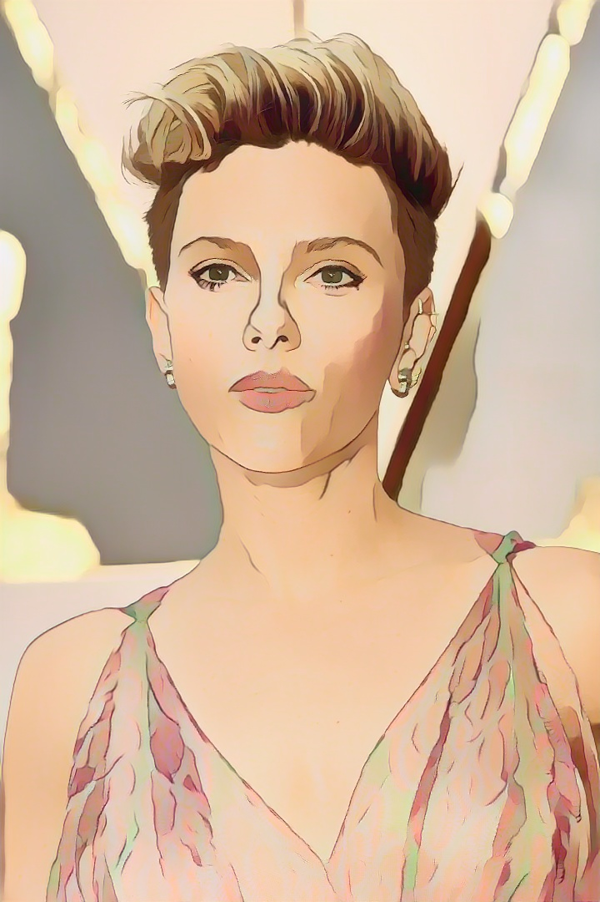
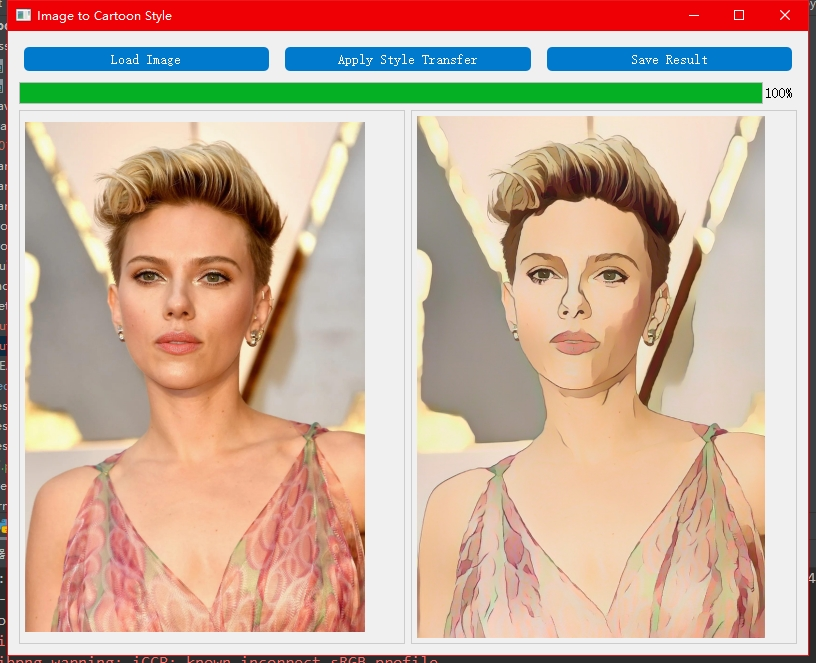
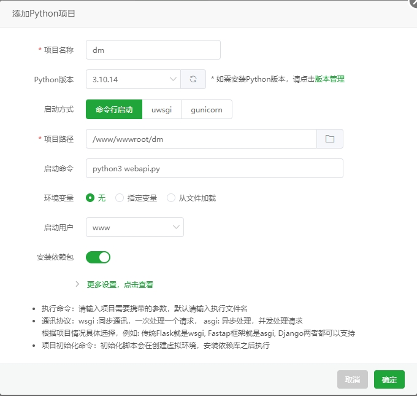
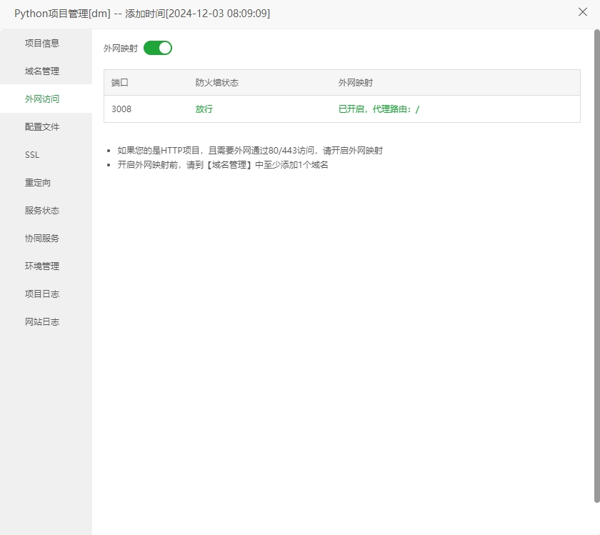

# 动漫风图片API端 - onnx高效推理

# 介绍
一款Python版本的图片转新海诚动漫风格服务

源码出处：https://github.com/no1xuan/cartoon

原作者：https://swanhub.co/ZeYiLin/White-Box-Cartoon

**修改内容**：
1. 增加TensorFlow转ONNX，提高推理效率，转换代码：`python model2onnx.py`
2. onnx推理运行：`python cartoonizer_onnx.py`
3. 增加GUI界面，`python gui.py`

---

## 环境依赖
- Python 版本：3.10.14
- pip install -r requirements.txt

TensorFlow 转 ONNX 需要的库：
- tf2onnx==1.16.1
- onnx==1.15.0

加载ONNX模型需要的库：
- onnxruntime==1.16.1
 
GUI界面
- pyqt5==5.15.11

---

## 模型效果
- 原图：

    

- 转换后：

    


## GUI界面


成品：
- [夸克网盘](https://pan.quark.cn/s/e88a4225154a)
- [百度网盘](https://pan.baidu.com/s/1WIRAZl5lP6XBnUDsQQ2pGg?pwd=u4cg)


## Web api
#### 1. 本地运行：`python webapi.py`

#### 2. 服务端部署：

1.宝塔创建项目



2.需要绑定域名并开启外网映射


<br>
<hr>

# HTTP请求
```text
POST
http://你的域名/cartoon

传参：
参数名：image
内容是：base64的图片

注：无法通过ip直接请求，所以需要绑定域名     
```
